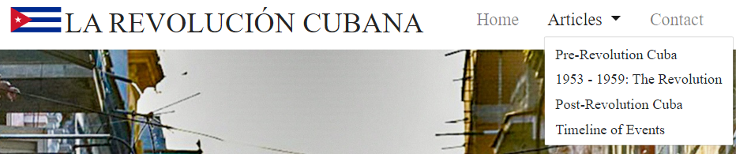
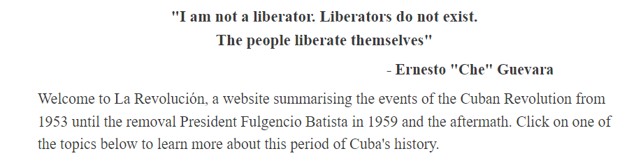
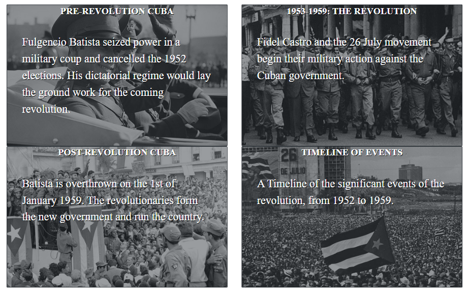
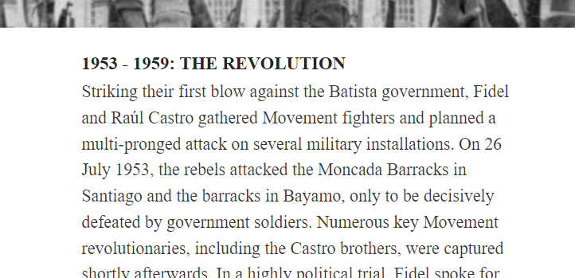
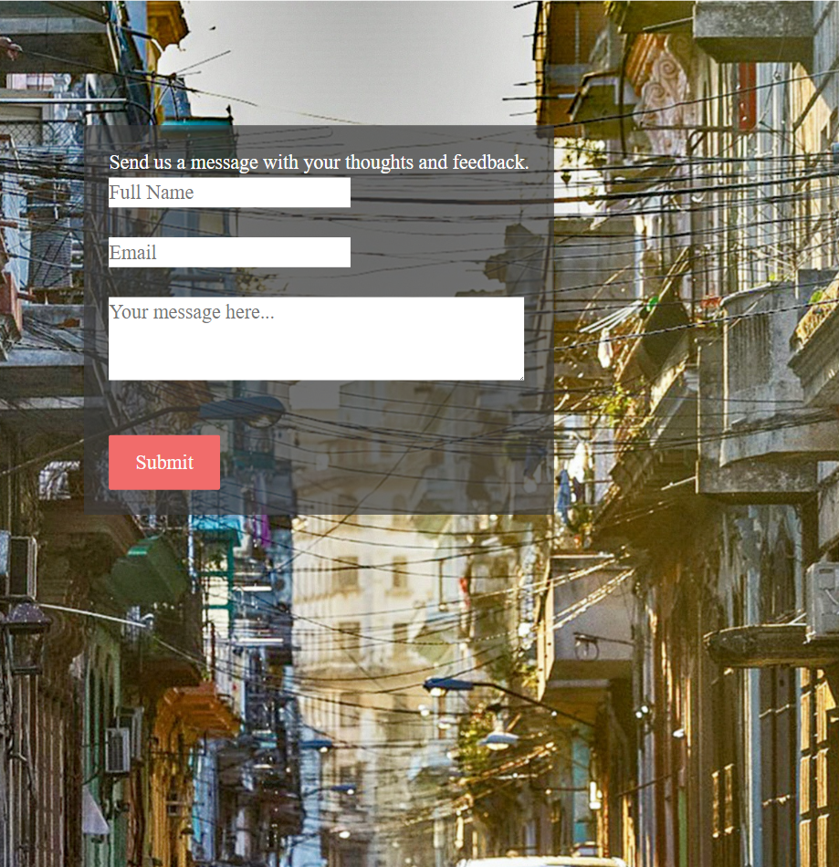
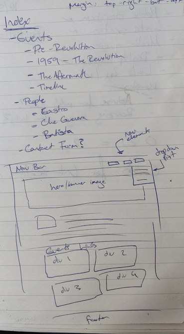

# La Revolución

[Link to live project](https://finnahern.github.io/Revolucion/)

This website is designed to be a summary of the events of the Cuban Revolution, presented in an accessible and aesthetically pleasing way. The site is targeted at people who may have a cursory knowledge of the events and want to learn more.

## Features

### Navigation bar

- Featured on all six pages of the website, The navbar makes every page accessible from every other page of the site, so the user never has to click the browser's back button.
- Fully responsive design using Bootstrap 4, the navbar has a toggleable burger menu button for mobile and smaller screen sizes.
- Features a dropdown menu to access all four article pages while avoiding visual clutter.

### Hero image

- The index page and each article features a hero image, making each page visually distinct and immediately recognisable.

### About section

- Below the hero image on the index page is the about section with a quote from Che Guevara and a brief paragraph introducing the site and prompting the user to explore further.

### Links section

- Using the cards feature of Bootstrap 4 to visually represent each of the four article pages with background images and a short paragraph of text summarising their content, the link cards invite the user to explore the site further.
- The cards are responsive to the view port width and will arrange themselves in a 4x1, 2x2 or 1x4 configuration depending on the screen size.

### Article sections

- Each article page includes a header, the body of the article and a citation link at the bottom to the source of the text used.

### Contact form

- The contact form consists of a large background image instead of a hero image and a short form inviting the user to provide comments and feedback. 

### Footer

- The footer is anchored to the bottom of each page and contains icons which link to various social media sites. I used the method described in [this video](https://www.youtube.com/watch?v=yc2olxLgKLk&) to anchor the footer.

## Design process

### Wire frame

When I began the project the first thing I did was sketch a wireframe model in a notebook of what the index page would look like. I was happy with the design and it remained largely unchanged throughout the whole process.

I kept the rest of the design minimal with a muted colour pallette, using white and grey for the header and footer to match the mostly black and white photographs used because of the subject matter.

### Deployment

The site was developed using the Gitpod IDE and deployed using Github pages. The [Gitpod Chrome plugin](https://chrome.google.com/webstore/detail/gitpod-dev-environments-i/dodmmooeoklaejobgleioelladacbeki) was also used for easy access to the repository and the development enviornment.

## Testing

- All HTML documents and the CSS stylesheet passed validation on the [W3C Validator](https://validator.w3.org/nu/?doc=https%3A%2F%2Fcode-institute-org.github.io%2Flove-running-2.0%2Findex.html#textarea).
- Tested the site using the Chrome, Firefox and Edge browsers on a Windows desktop PC, the Chrome browser for Android on a OnePlus 6 phone as well as a variety of simulated mobile devices and screen sizes using the Chrome developer tools.

## Credits

### Acknowledgements

Spencer Barriball for his invaluable feedback and advice.

David Malone for his support and encouragement.

Everyone at the Code Institute support team and Slack community.

### External code used

- [Template Bootstrap nav bar](https://getbootstrap.com/docs/4.0/components/navbar/)
- [Bootstrap Image overlay cards for links section](https://getbootstrap.com/docs/4.0/components/card/)

### Technology used

- HTML
- CSS
- [Bootstrap](https://getbootstrap.com/) - Templates used for nav bar, dropdown menu and link cards.
- [Google fonts](https://fonts.google.com/) - Resource used to import fonts.
- [Font Awesome](https://fontawesome.com/) - Resource used to import icons for footer.
- [Git](https://git-scm.com/) - Version control.
- [Github](https://github.com/) - Used to host repository and live site.
- [Gitpod IDE](https://gitpod.io/) - Development enviornment used to build site.
- [Chrome developer tools](https://developer.chrome.com/docs/devtools/) - Tools to test and preview site throughout development.
- [W3C Validator](https://validator.w3.org/) - Used to validate code and check for errors.

### Resources

- [Bootstrap Documentation](https://getbootstrap.com/docs/5.0/getting-started/introduction/)
- [CSS-Tricks A Complete Guide to Flexbox](https://css-tricks.com/snippets/css/a-guide-to-flexbox/)
- [Engage Interactive EM vs REM vs PX](https://engageinteractive.co.uk/blog/em-vs-rem-vs-px)
- [W3Schools](https://www.w3schools.com/)

### Text and Image Credits

- Index page hero image: [istock Photo](https://www.istockphoto.com/photo/street-with-cuban-flag-in-havana-gm525352138-92393555?irgwc=1&cid=IS&utm_medium=affiliate&utm_source=TinEye&clickid=TaUzjcQ1PxyLUTH0WlXSvXJOUkBzqAzctXjY340&utm_term=&utm_campaign=&utm_content=435504&irpid=77643)
- President Batista in Washington DC, 1938: [Getty Images](https://www.gettyimages.ie/detail/news-photo/close-up-portrait-of-fulgencio-batista-cuban-leader-on-news-photo/614094458?irgwc=1&esource=AFF_GI_IR_TinEye_77643&asid=TinEye&cid=GI&utm_medium=affiliate&utm_source=TinEye&utm_content=77643)
- Fidel Castro and Che Guevara march in Havana, 1960: [Wikipedia](https://en.wikiquote.org/wiki/File:CheLaCoubreMarch.jpg)
- Fidel Castro speaks in Havana after the revolution succeeds, 1959: [Getty Images](https://www.gettyimages.ie/detail/news-photo/after-the-success-of-his-revolution-fidel-castro-surrounded-news-photo/535038409?irgwc=1&esource=AFF_GI_IR_TinEye_77643&asid=TinEye&cid=GI&utm_medium=affiliate&utm_source=TinEye&utm_content=77643)
- Havana Crowd, 1963: [Getty Images](https://www.gettyimages.ie/detail/news-photo/the-crowd-at-revolution-square-havana-during-celebrations-news-photo/3319697?irgwc=1&esource=AFF_GI_IR_TinEye_77643&asid=TinEye&cid=GI&utm_medium=affiliate&utm_source=TinEye&utm_content=77643)
- Presidential Palace, Havana, 1958: [Getty Images](https://www.gettyimages.ie/detail/news-photo/american-cars-parked-in-front-of-president-batistas-palace-news-photo/3396119?irgwc=1&esource=AFF_GI_IR_TinEye_77643&asid=TinEye&cid=GI&utm_medium=affiliate&utm_source=TinEye&utm_content=77643)
- First demonstration in support of the revolution, 1959: [Getty Images](https://www.gettyimages.ie/detail/news-photo/cuba-first-demonstration-in-support-of-the-revolution-in-news-photo/56202772?irgwc=1&esource=AFF_GI_IR_TinEye_77643&asid=TinEye&cid=GI&utm_medium=affiliate&utm_source=TinEye&utm_content=77643)
- Timeline hero image, Revolutionary art: [Luis Resendiz/thoughtco.com](https://www.thoughtco.com/the-cuban-revolution-2136372)
- Contact page background: [Dorothea Oldani](https://unsplash.com/photos/_Jkoj5toA7M)

Article text  was sourced from Wikipedia, specific pages are cited at the bottom of each article page.
